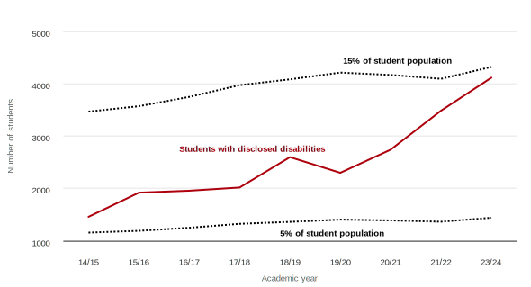

## More students are disclosing disabilities

There has been a 182% increase in the number of students declaring a
disability during their studies at Newcastle University over the past 9
years, rising from 1,458 in 2014/15 to 4,114 in 2023/24. In the same
period, the total student population has increased by only 25%. That is,
the proportion of students disclosing a disability has significantly
increased over the last decade. In 2014/15, only 6% of students
disclosed a disability, whereas in 2023/24, 14% of students did.

Focusing on more recent trends, there has been a notable increase in
disclosures of mental health disabilities in particular, from 587
students in 2018/19 to 1,281 students in 2023/24, a 118% increase.
Additionally, more students are disclosing multiple disabilities, with
the number rising from 182 in 2018/19 to 499 in 2023/24, a 174%
increase. This suggests an upward trend in the complexity of students'
access needs.

<figure>
    
    <figcaption>Disability disclosure trends</figcaption>
</figure>

<figure>
    
    <figcaption>Mental health and multiple disability disclosure</figcaption>
</figure>

In the MSP school 13% of the student population had an active SSP as of
2022/23. This is the highest proportion among all schools in SAgE, with
the School of Computing at 7%, the School of Engineering at 6%, and the
School of Natural and Environmental Sciences at 12%. Overall, SAgE had a
proportion of 9%.

However, even these figures do not tell the whole story. Disclosure
rates are generally low due to various factors, including stigma, lack
of enforcement of disability laws and guidelines, the fear of
discrimination, and the desire to assimilate with non-disabled peers
([Eccles et al., 2018; Ju et al., 2017; Mamboleo et al., 2019; Kohli
2018](../bibliography/#Eccles)). Indeed, research indicates that only about 35% of
students with disabilities disclose their disability to their university
([Newman & Madaus, 2015](../bibliography/#Newman)). Within MSP then, using the
data from 2022/23, the proportion of students who are disabled or have a
diagnosed/diagnosable medical condition of some form could be as high as
37% (assuming that 35% of such students choose to disclose).

Indeed, in a 2022 survey by the mental health charity [Student
Minds](../bibliography/#StudentMinds), 57% of respondents self-reported a mental health
issue and 27% said they had a diagnosed mental health condition, the
official figure for students in the year 2021/22 was only 5% ([The
Higher Education Statistics Agency, 2023](../bibliography/#HESA)).

These problems surrounding disclosure highlight that the university's
efforts to support disabled students need to address not only those who
disclose but also those who choose not to.

<figure class="table-wrapper">
<table id="disclosure-data">
<thead>
<tr><th scope="col">Academic year</th>
<th scope="col">Students with disclosed disabilities</th>
<th scope="col">Mental health difficulties</th>
<th scope="col">Multiple disabilities</th>
<th scope="col">Student population</th></tr>
</thead>
<tbody><tr><td>14/15</td><td>1,458</td><td>104</td><td>41</td><td>23,100</td></tr>
<tr><td>15/16</td><td>1,919</td><td>248</td><td>81</td><td>23,800</td></tr>
<tr><td>16/17</td><td>1,956</td><td>279</td><td>73</td><td>25,000</td></tr>
<tr><td>17/18</td><td>2,017</td><td>322</td><td>72</td><td>26,500</td></tr>
<tr><td>18/19</td><td>2,597</td><td>587</td><td>182</td><td>27,200</td></tr>
<tr><td>19/20</td><td>2,298</td><td>461</td><td>126</td><td>28,100</td></tr>
<tr><td>20/21</td><td>2,740</td><td>651</td><td>202</td><td>27,800</td></tr>
<tr><td>21/22</td><td>3,484</td><td>1,008</td><td>330</td><td>27,300</td></tr>
<tr><td>23/24</td><td>4,114</td><td>1,281</td><td>499</td><td>28,800</td></tr></tbody>
</table>
<figcaption>Student disability disclosure data</figcaption>
</figure>

